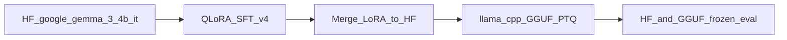

# Gemma v4 — Project briefing for external LLMs

**Audience:** GPT / Claude / similar models given this file as primary project context.  
**Subject checkpoint:** `gemma3_4b_merged_v4` (Gemma 3 4B QLoRA SFT on `sft_mix_v4`, no CPT).  
**Repo root:** `/scratch/nz2212/adtc-hackathon`  
**As of:** 2026-08-22

---

## 1. Executive summary

This is an **ADTC 2026 Gate 1** entry for the offline multilingual STEM tutor track (`math_scientific_reasoning`).

**Product goal:** one dense **1.7–4B GGUF** that runs on an **8 GB laptop** via llama.cpp, in **English + Amharic**, with tutoring behaviors (explain / hint / diagnose)—not only MCQ answers. No multi-model runtime and no runtime machine translation.

**Score weights:** 50% accuracy · 30% throughput (ref ~15 tok/s) · 20% memory \(S_{\mathrm{eff}}=100\times(7-\mathrm{PeakRAM})/7\). Hard: peak RSS ≤ 7 GB; thermal penalty above 85°C.

**Phase-2 finalists:** efficiency → **Qwen3-1.7B**; accuracy / Amharic fertility → **Gemma 3 4B**. This briefing centers on the latest Gemma-only path (**v4**).

### Verdict (do not treat v4 as automatic “best”)

| Metric | Winner among Gemma full-set evals |
|--------|-----------------------------------|
| HF AfriMGSM **Amharic** | **v3** (0.232) > v4 (0.216) |
| HF AfriMGSM English | **v4** (0.352) |
| HF EN STEM holdout | **v4** (0.38) |
| HF tutoring (soft) | **v4** (0.921) |
| HF translate-test direct AM | **v4** (0.124) > v3 (0.100) |
| GGUF Q4 AfriMGSM AM | **v4** (0.216) ≥ v2/v3 |
| GGUF Q4 tutoring | **v3** (0.941) > v4 (0.921) |

**v4** is the latest Gemma run (tutoring-heavy mix, SFT from stock IT, no CPT). **v3** remains best on primary HF Amharic MGSM. Hardware-weighted Gate 5 leaderboard (older, n=50-era) still ranked **Qwen3-1.7B Q4 v0** highest on composite score—not refreshed for Gemma v2–v4 full suites.

---

## 2. Product constraints and phase gates

| Constraint | Detail |
|------------|--------|
| Languages | Locked **Amharic (`am` / HF `amh`) + English** — see `adtc/docs/LANGUAGE.md` |
| Artifact | Exactly **one** dense GGUF + llama.cpp |
| Forbidden | Multi-LLM routers, runtime MT sandwich, starting from 7B+ and shrinking |
| Deadline (PRD) | **25 Aug 2026** |
| Validator | Nathan Behailu (Amharic review before `african_alpha_claim`) |

**Phase gates (high level):** 0 packaging smoke → 1a language+eval freeze → 2 unadapted screen → 3 bilingual mix → 4 adapted eval (CPT only if needed) → 5 GGUF PTQ + Pareto → 7 package / REPORT / demo. Full plan: `adtc/docs/PRD.md`.

---

## 3. System architecture

### Locked train → deploy pipeline

1. **HF base** (Hub) → optional CPT (v3 only) → **QLoRA SFT** (TRL + PEFT, A100 bf16, 4-bit NF4)  
2. **Merge LoRA** into full HF weights under `adtc/training/runs/`  
3. **Convert** → high-precision GGUF → PTQ ladder **f16 → Q8 → Q6 → Q5 → Q4_K_M**  
4. **Eval** on frozen suites (HF GPU and/or CPU llama.cpp GGUF)  
5. **Ship** one GGUF via submission template + `download_model.sh`

`QLoRA 4-bit during training ≠ GGUF Q4 at deployment.`

### v4-specific path (no CPT)

`google/gemma-3-4b-it` → QLoRA on `sft_mix_v4.jsonl` → `gemma3_4b_merged_v4` → GGUFs under `adtc/artifacts/gguf/adapted/`.

| Role | Path / tool |
|------|-------------|
| Train | `adtc/training/train_sft_qlora.py` + `configs/qlora_gemma3_4b_v4.yaml` |
| Merge | `adtc/training/merge_lora.py` |
| Slurm chain | `adtc/hpc/submit_v4_chain.sh` (`02f` prep → `04e` SFT → `05d` merge → `08d` GGUF → `12e`/`12f` eval) |
| Interactive probe | `adtc/eval/try_prompt.py` **MODEL 8** = Gemma v4 Q4 |
| HPC | NYUAD Jubail; partition `nvidia` (A100); logs `adtc/hpc/logs/` |

### Contrast: v3 path

CPT QLoRA on `cpt_mix_v3.jsonl` (20k) → merge CPT → SFT QLoRA on `sft_mix_v3.jsonl` (8576) from CPT-merged base → `gemma3_4b_merged_v3`. **Same SFT hyperparameters as v4**; different base and mix.

---

## 4. Model architecture and hyperparameters (v4)

### Base model (merged `config.json`)

| Property | Value |
|----------|--------|
| Hub id | `google/gemma-3-4b-it` |
| Class | `Gemma3ForConditionalGeneration` / `gemma3` |
| Hidden size | 2560 |
| Layers | 34 |
| Attention | 8 heads / 4 KV heads; head_dim 256 |
| Vocab | 262208 |
| Max position | 131072 (train used `max_seq_length: 2048`) |
| Training method | **QLoRA only** (not full fine-tune); adapters merged for deploy |

### Training hyperparameters

Source: `adtc/training/configs/qlora_gemma3_4b_v4.yaml` + `runs/gemma3_4b_qlora_v4/train_metrics.json`.

| Hyperparameter | Value |
|----------------|--------|
| Learning rate | `1.5e-4` |
| LR schedule | cosine |
| Warmup | `warmup_ratio: 0.03` |
| Epochs | 2 |
| Max / actual steps | **1000** |
| Per-device batch | 1 |
| Grad accumulation | 16 → **effective batch 16** |
| Max seq length | 2048 |
| Seed | 42 |
| Precision | `bf16: true` + gradient checkpointing |
| BitsAndBytes | `load_in_4bit`, NF4, double quant, compute `bfloat16` |
| LoRA r / α / dropout | 16 / 32 / 0.05 |
| LoRA targets | `q_proj, k_proj, v_proj, o_proj, gate_proj, up_proj, down_proj` |
| Packing | false (in train script) |
| Data | `adtc/data/train/sft_mix_v4.jsonl` (**7999** rows) |
| Train runtime | ~12637 s (~3.5 h) on A100-PCIE-40GB |
| Final train loss | **1.005** |
| run_id | `78128302` |

### Artifacts and Slurm jobs (successful chain)

| Artifact | Path |
|----------|------|
| QLoRA run / checkpoints | `adtc/training/runs/gemma3_4b_qlora_v4/` (`checkpoint-{200..1000}`) |
| Final adapter | `…/gemma3_4b_qlora_v4/adapter/` |
| Merged HF | `adtc/training/runs/gemma3_4b_merged_v4/` |
| GGUF Q4 (primary deploy candidate among v4 quants) | `adtc/artifacts/gguf/adapted/gemma3_4b_merged_v4-Q4_K_M.gguf` |
| Other quants | Q5 / Q6 / Q8 / f16 + `manifest_v4.json` |

Jobs: prep `17367352` → SFT `17367353` → merge `17367354` → GGUF `17367355` → GGUF eval `17367356` → HF eval `17367357`.

---

## 5. Data

### Pipeline stages

1. `download_train_sources.py` → `data/raw/snapshots/`  
2. `normalize_cpt_sources.py` / `normalize_sft_sources.py` → CPT folders + `data/train/sources/`  
3. Builders: EN STEM, NLLB AM STEM, tutoring (authored/derived), AM stem pool  
4. Mix + dedup against frozen eval (`adtc/data/eval/FREEZE.md` — **never train on eval**)  
5. Train on JSONL mix

**SFT row schema:** `id`, `direction` ∈ {en_en, am_am, en_am, am_en}, `behavior` ∈ {solve, explain, hint, first_error, instruct, code_switch, …}, `messages[]`, `source`.

### Frozen eval (do not train)

| File | Rows | Role |
|------|-----:|------|
| `afrimgsm_amh_test_v0.jsonl` | 250 | AfriMGSM Amharic (primary AM STEM) |
| `afrimgsm_eng_test_v0.jsonl` | 250 | AfriMGSM English |
| `afrimmlu_amh_test_v0.jsonl` | 500 | AfriMMLU Amharic |
| `afrixnli_amh_test_v0.jsonl` | 600 | Frozen; **not scored** in current runners |
| `en_stem_holdout_v0.jsonl` | 100 | GSM8K test[:100] |
| `custom_tutoring_v0.jsonl` | 101 | Authored tutoring soft-pass |
| `fertility_parallel_v0.jsonl` | 10 | Tokenizer fertility only |

### v4 mix design vs what actually ran

**Intent:** AfriqueLLM GSM8K as primary AM solve; **no simonbutt**; expanded AM tutoring; **no CPT**; targets **40% AM stem / 25% tutoring / 20% EN / 10% instruct / 5% replay**.

**Reality:** Hub **404** for `peterlu02/afriquellm-coldstart-gsm8k-11lang` → pool mode `nllb+simonbutt_capped` (`am_stem_pool_v4_stats.json`: NLLB good 657, simonbutt used 2500 of 7473).

**Actual mix** (`sft_mix_v4_counts.json`, n=7999):

| Source | Count |
|--------|------:|
| gsm8k_train_v4 (EN) | 2703 |
| simonbutt_amharic_gsm8k | 2500 |
| am_tutoring_derived_v4 | 1200 |
| walia | 695 |
| mt_nllb filtered_v2 | 657 |
| am_tutoring_v4 (authored) | 139 |
| dolly_am | 105 |

| Direction | Count | Behavior (top) | Count |
|-----------|------:|----------------|------:|
| am_am | 5288 | solve | 3881 |
| en_en | 2703 | first_error | 1128 |
| en_am | 8 | hint | 1113 |
| | | explain | 1069 |
| | | instruct | 800 |
| | | code_switch | 8 |

**Prior mixes (for lineage):** v0 2k (Phase 4 all models) → v2 5701 → v3 8576 (post-CPT) → v4 7999. Catalog: `adtc/docs/DATASETS.md`. On-disk status as of 18 Aug is partly stale: `DATASETS_REPORT.md` (CPT later ran in v3; mixes v2–v4 after that report).

### Key data scripts (v4)

- `adtc/data/build_am_stem_pool_v4.py`  
- `adtc/data/build_tutoring_sft_v4.py` / `derive_am_tutoring_v4.py`  
- `adtc/data/mix_sft_v4.py`  
- Prep: `adtc/hpc/02f_prepare_mix_v4.sbatch`

---

## 6. Evaluation results

**Scoring:** `adtc/eval/aggregate_perf.py` — \(S = 0.5\,S_{\mathrm{acc}} + 0.3\,S_{\mathrm{tps}} + 0.2\,S_{\mathrm{mem}}\). Tutoring soft-pass is **excluded from \(S_{\mathrm{acc}}\)**. Translate-test measures language vs reasoning gap on index-aligned AfriMGSM am↔eng.

**Important:** `RESULTS_REPORT.md` Phase 4 / leaderboard tables are largely **n=50** era. Prefer full-suite artifacts below for Gemma v2–v4.

### 6.1 HF adapted eval (full suites)

| Model | am MGSM | en MGSM | am MMLU | en holdout | tutoring |
|-------|--------:|--------:|--------:|-----------:|---------:|
| `gemma3_4b_merged_v0` | 0.180 | 0.320 | 0.260 | 0.32 | 0.70 |
| `gemma3_4b_merged_v2` | 0.204 | 0.328 | 0.218 | 0.32 | 0.881 |
| `gemma3_4b_merged_v3` | **0.232** | 0.336 | 0.208 | 0.34 | 0.911 |
| `gemma3_4b_merged_v4` | 0.216 | **0.352** | 0.214 | **0.38** | **0.921** |

Sources: `docs/artifacts/phase4_adapted_eval_v{0,2,3,4}.md` (v0 was n=50; v2–v4 full). JSON: `phase4_eval_gemma3_4b_merged_v{2,3,4}.json`.

### 6.2 Translate-test (N=250, HF)

| Checkpoint | Direct AM | EN translate | Gap |
|------------|----------:|-------------:|----:|
| HF v2 | 0.120 | 0.188 | +0.068 |
| HF v3 | 0.100 | 0.160 | +0.060 |
| HF v4 | **0.124** | **0.196** | +0.072 |

GGUF Q4: v3 direct 0.092 / translate 0.136; v4 direct **0.104** / translate **0.200**.

### 6.3 GGUF Q4 frozen eval (full)

| GGUF | am MGSM | en MGSM | am MMLU | holdout | tutoring |
|------|--------:|--------:|--------:|--------:|---------:|
| v2-Q4 | 0.208 | 0.328 | 0.220 | 0.33 | 0.891 |
| v3-Q4 | 0.204 | 0.288 | 0.210 | 0.26 | **0.941** |
| v4-Q4 | **0.216** | **0.356** | 0.212 | **0.37** | 0.921 |

### 6.4 Tokenizer fertility (base models)

On 10 authored EN‖am pairs (`fertility_v0.json`): Qwen3 family **severe** (`mean R_am/en ≈ 4.3`); Gemma 3 4B **ok** (`≈ 2.1`). Tokenizer extension still deferred.

### 6.5 Gate 5 hardware leaderboard (stale for v2–v4)

Older n=50 GGUF + profiler on Jubail compute: rank 1 **`qwen3_1_7b_merged_v0-Q4_K_M`** total ~29.4; Gemma v0 Q4 ~26.0. **No refreshed ADTC composite** yet for Gemma v3/v4 full-set GGUFs with laptop/profiler TPS+RSS.

---

## 7. Known issues and caveats

1. **AfriqueLLM unavailable** — v4 intent (AfriqueLLM-first, no simonbutt) failed; mix fell back to capped simonbutt + NLLB.  
2. **v4 skipped CPT by design** — v3’s AM MGSM lead may partly come from CPT+mix, not SFT hypers.  
3. **AM↔EN gap remains large** on translate-test (direct AM still ~0.10–0.12 HF).  
4. **Primary metric tension:** HF am MGSM favors v3; EN/tutoring/GGUF-AM favor v4.  
5. **Docs drift:** `DATASETS_REPORT.md` (18 Aug) and `RESULTS_REPORT.md` (n=50 / Gate 5) are incomplete relative to v2–v4 full evals—trust `DEVLOG.md` + `docs/artifacts/phase4_*` + `docs/artifacts/perf/`.  
6. **Submission packaging** (`adtc-2026-submission-template/`) still needs Phase 7 fill-in.  
7. Qwen fertility severe; no tokenizer surgery planned for Gate 1 unless post-deadline.

---

## 8. Recommended next steps

Prioritized for a model advising this team before Gate 1 ship:

1. **Pick deploy GGUF explicitly**  
   - Accuracy / Amharic MGSM story → Gemma **v3** Q4 (best HF am MGSM).  
   - Tutoring / EN / GGUF-AM balance → Gemma **v4** Q4.  
   - Hardware-weighted composite (historical) → Qwen3-1.7B Q4 v0—but Amharic accuracy is near-zero; only if score formula dominates and Amharic claims are soft.  
   Document the tradeoff in competition `REPORT.md`.

2. **Nathan Amharic review** on `docs/artifacts/amharic_review_sample_v4.jsonl` + `try_prompt.py` MODEL 8 (and v3 MODEL 7 if present) before asserting `african_alpha_claim`.

3. **Phase 7 packaging** — fill submission template: `metadata.json`, `download_model.sh`, one GGUF path, `REPORT.md`, 2-minute demo (offline EN+AM tutoring + profiler numbers).

4. **Re-aggregate ADTC-shaped score** on Gemma v3 and v4 Q4 (and maybe Q5) with profiler TPS + peak RSS on the target laptop or Standard Laptop profile—current full-set tables lack fresh hardware totals.

5. **If AfriqueLLM Hub returns** — rebuild AM stem pool without simonbutt and re-run SFT (true v4 intent); compare to current fallback v4.

6. **If AM MGSM is the binding constraint** — try hybrid: CPT-merged v3 base + v4-style tutoring-heavy mix (same hypers), rather than more epochs alone.

7. **Optional post-Gate:** tokenizer work for Qwen if revisiting efficiency finalist; laptop thermal/profiler soak test on chosen GGUF.

---

## 9. Pointer index

| Doc / artifact | Path |
|----------------|------|
| This briefing | `adtc/docs/GEMMA_V4_CONTEXT.md` |
| Product + gates | `adtc/docs/PRD.md` |
| Day-to-day truth | `adtc/docs/DEVLOG.md` |
| Language lock | `adtc/docs/LANGUAGE.md` |
| Dataset catalog | `adtc/docs/DATASETS.md` |
| Eval freeze | `adtc/data/eval/FREEZE.md` |
| Tooling pins | `adtc/docs/TOOLING.md` |
| HPC ops | `adtc/hpc/README.md` |
| Training README | `adtc/training/README.md` |
| v4 config | `adtc/training/configs/qlora_gemma3_4b_v4.yaml` |
| Mix counts | `adtc/docs/artifacts/sft_mix_v4_counts.json` |
| Stem pool stats | `adtc/docs/artifacts/am_stem_pool_v4_stats.json` |
| HF eval v4 | `adtc/docs/artifacts/phase4_adapted_eval_v4.md` |
| GGUF eval v4 | `adtc/docs/artifacts/perf/gemma3_4b_merged_v4-Q4_K_M_v4_eval.json` |
| Translate v4 | `adtc/docs/artifacts/perf/translate_gemma3_4b_merged_v4.md` |
| Older measured report (stale n=50) | `adtc/docs/RESULTS_REPORT.md` |

### Acknowledgement

Training/eval used NYUAD Jubail: *This research was carried out on the High Performance Computing resources at New York University Abu Dhabi.*
