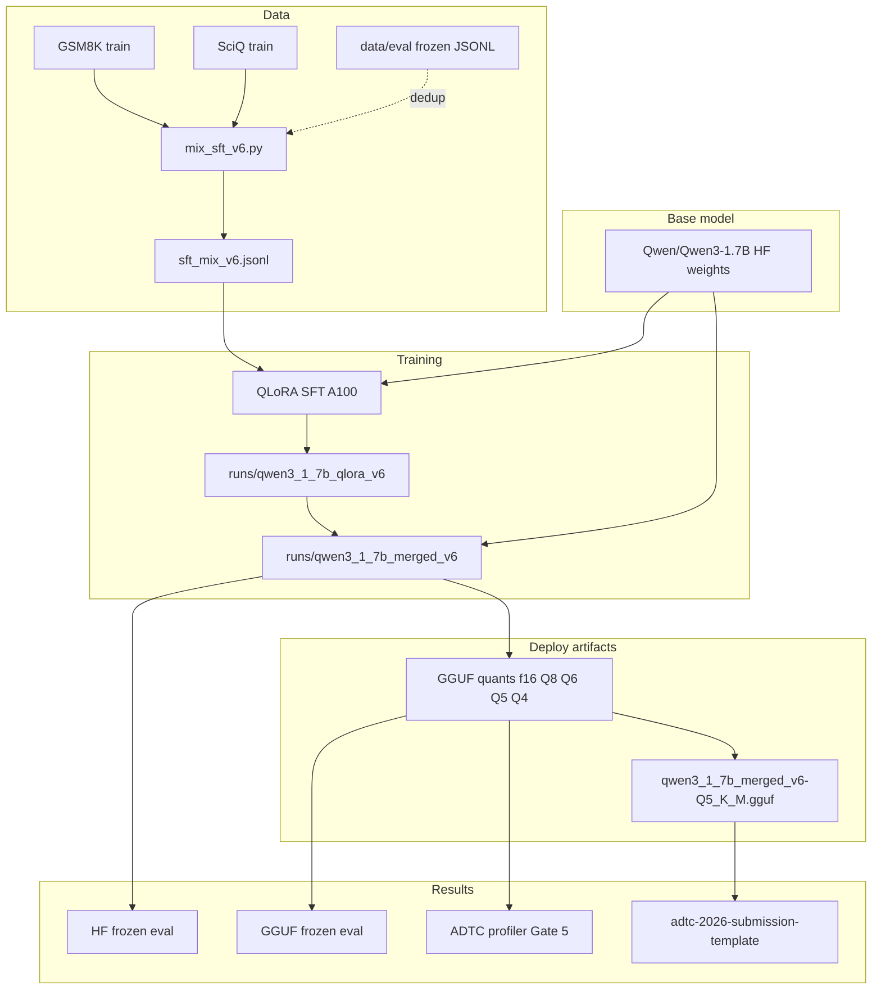

# ADTC v6 Pipeline — Data → Model → Training → Results

End-to-end map of the English-only Qwen3-1.7B STEM tutor project. For Slurm commands see [`hpc/README.md`](../hpc/README.md); for numbers see [`RESULTS_REPORT.md`](./RESULTS_REPORT.md).

---

## Overview



**Deploy pick:** `artifacts/gguf/adapted/qwen3_1_7b_merged_v6-Q5_K_M.gguf` (~1.2 GB, Gate 5 profiler winner).

---

## 1. Data

### Training mix

| Item | Detail |
|------|--------|
| Builder | [`data/mix_sft_v6.py`](../data/mix_sft_v6.py) |
| Output | `data/train/sft_mix_v6.jsonl` (10473 rows) |
| Sources | GSM8K train (7473), SciQ train (3000) |
| Behaviors | solve, explain, hint, first_error (GSM8K); solve, explain (SciQ) |
| Dedup | Against `en_stem_holdout_v0` + `afrimgsm_eng_test_v0` (0 dropped) |

Each row is chat JSONL:

```json
{
  "id": "en_en_solve_gsm8k_v6_00000",
  "direction": "en_en",
  "behavior": "solve",
  "messages": [
    {"role": "user", "content": "..."},
    {"role": "assistant", "content": "..."}
  ],
  "source": "gsm8k_train_v6"
}
```

HPC: `sbatch prepare_mix.sbatch` (or step 1 of `bash submit_chain.sh`).

### Frozen eval (never train on these)

Under [`data/eval/`](../data/eval/):

| File | n | Primary use |
|------|--:|-------------|
| `afrimgsm_eng_test_v0.jsonl` | 250 | EN math accuracy |
| `en_stem_holdout_v0.jsonl` | 100 | GSM8K test holdout |
| `custom_tutoring_v0.jsonl` | 101 | Tutoring rubric |
| `afrimgsm_amh_test_v0.jsonl` | 250 | Secondary (not trained) |
| `afrimmlu_amh_test_v0.jsonl` | 500 | Secondary (not trained) |

Dedup helper: [`eval/dedup_against_eval.py`](../eval/dedup_against_eval.py).

### Caches

| Path | Contents |
|------|----------|
| `data/raw/hf/` | GSM8K + SciQ via `datasets` |
| `data/raw/hf_home/` | `Qwen/Qwen3-1.7B` weights |

---

## 2. Model

| Stage | Artifact | Path |
|-------|----------|------|
| Hub base | Qwen3-1.7B | `Qwen/Qwen3-1.7B` |
| LoRA adapter | QLoRA weights | `training/runs/qwen3_1_7b_qlora_v6/adapter/` |
| Merged HF | Full fine-tuned weights | `training/runs/qwen3_1_7b_merged_v6/` |
| GGUF f16 | Unquantized deploy intermediate | `artifacts/gguf/adapted/qwen3_1_7b_merged_v6-f16.gguf` |
| **Submission GGUF** | Q5_K_M quant | `artifacts/gguf/adapted/qwen3_1_7b_merged_v6-Q5_K_M.gguf` |

Config: [`training/configs/qlora_qwen3_1_7b_v6.yaml`](../training/configs/qlora_qwen3_1_7b_v6.yaml).

Download base: `python training/download_base_models.py --only qwen3_1_7b` or `sbatch download_models.sbatch`.

---

## 3. Training

Pipeline shape: **SFT only** (no CPT). QLoRA 4-bit during training ≠ GGUF Q4 at inference.

| Step | Script | Slurm |
|------|--------|-------|
| QLoRA SFT | `training/train_sft_qlora.py` | `train_sft.sbatch` |
| Merge LoRA | `training/merge_lora.py` | `merge_lora.sbatch` |
| HF → GGUF | llama.cpp convert + quantize | `convert_gguf.sbatch` |

```bash
cd adtc/hpc
bash submit_chain.sh   # runs all steps with Slurm dependencies
```

Thinking mode is off for scoring: HF `enable_thinking=False`; GGUF prompts use `/no_think` where applicable.

---

## 4. Evaluation & results

### HF eval (merged checkpoint, GPU)

Script: [`eval/run_hf_eval.py`](../eval/run_hf_eval.py)  
Slurm: `eval_hf.sbatch`  
Artifact: [`docs/artifacts/v6/qwen3_1_7b_merged_v6_hf_eval.json`](./artifacts/v6/qwen3_1_7b_merged_v6_hf_eval.json)

| Suite | acc |
|-------|----:|
| AfriMGSM EN | 0.392 |
| EN STEM holdout | 0.370 |
| Custom tutoring | 0.980 |

### GGUF eval (llama.cpp, CPU)

Script: [`eval/run_gguf_eval.py`](../eval/run_gguf_eval.py)  
Slurm: `eval_gguf.sbatch` (Q4 and Q5 jobs)  
Artifacts: `docs/artifacts/v6/qwen3_1_7b_merged_v6-Q{4,5}_K_M_eval.json`

### Profiler / Gate 5

Slurm: `profile_gguf.sbatch`  
Winner: [`docs/artifacts/v6/phase5_gate5_winner_v6.json`](./artifacts/v6/phase5_gate5_winner_v6.json)

| Metric | Q5_K_M |
|--------|-------:|
| TPS | 2.46 |
| Peak RSS | 1402 MB |
| Composite | 21.01 |

### Qualitative smoke

[`eval/try_prompt.py`](../eval/try_prompt.py) — single model, English prompts 1–5.  
Slurm: `sbatch try_prompt.sbatch`

---

## 5. Submission packaging

Staged template at repo root:

```
adtc-2026-submission-template/
  metadata.json
  download_model.sh
  model/model.gguf    # hardlink to Q5_K_M winner
```

Stage manually:

```bash
cd adtc
python eval/stage_gguf_submission.py \
  --gguf artifacts/gguf/adapted/qwen3_1_7b_merged_v6-Q5_K_M.gguf \
  --out-dir ../adtc-2026-submission-template \
  --name qwen3_1_7b_merged_v6-Q5_K_M \
  --quant Q5_K_M \
  --params 1.7B
```

Still needed for Gate 1: `REPORT.md` in the template + 2-minute laptop demo video.

---

## 6. Directory map

```
adtc/
  data/
    mix_sft_v6.py          # build training mix
    train/sft_mix_v6.jsonl # training data (gitignored)
    eval/*.jsonl           # frozen benchmarks
  training/
    configs/qlora_qwen3_1_7b_v6.yaml
    train_sft_qlora.py
    merge_lora.py
    runs/qwen3_1_7b_*_v6/  # adapters + merged HF (gitignored)
  artifacts/gguf/adapted/  # GGUF quants (gitignored)
  eval/                    # run_hf_eval, run_gguf_eval, try_prompt
  hpc/                     # Slurm scripts + submit_chain.sh
  docs/artifacts/v6/       # committed eval + profiler JSON
```

---

## 7. Related docs

| Doc | Contents |
|-----|----------|
| [`PRD.md`](./PRD.md) | Product goals + success criteria |
| [`DATASETS.md`](./DATASETS.md) | Train/eval source details |
| [`RESULTS_REPORT.md`](./RESULTS_REPORT.md) | Measured numbers |
| [`RUNLOGS.md`](./RUNLOGS.md) | Per-stage OK/FAIL logs |
| [`artifacts/v6/MILESTONE_REPORT.md`](./artifacts/v6/MILESTONE_REPORT.md) | v6 milestone summary |
